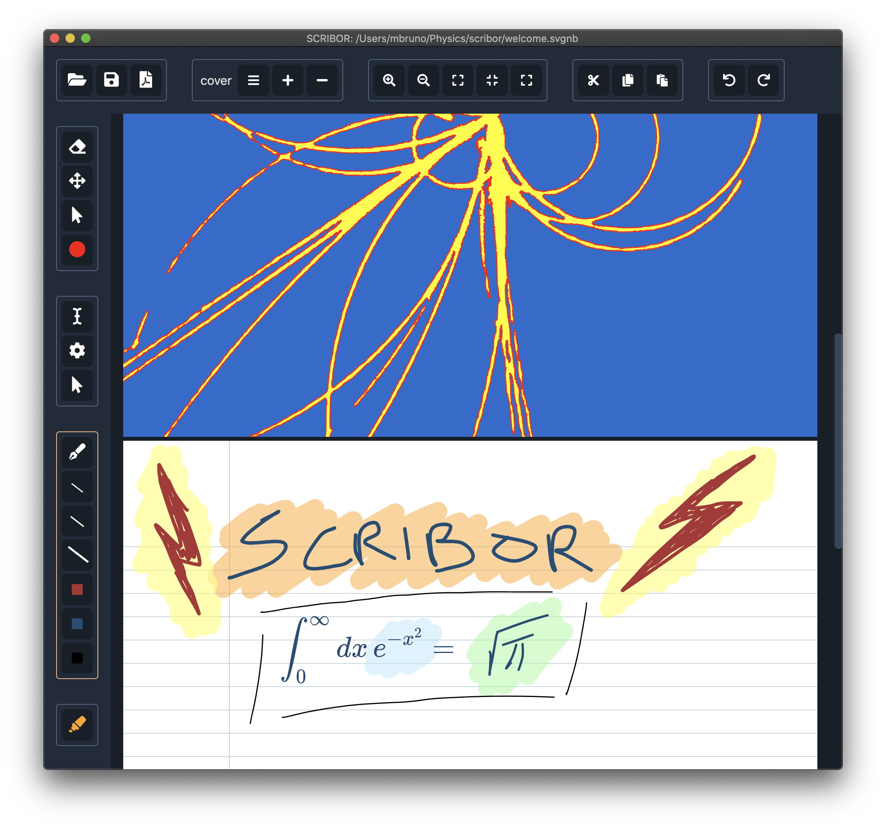

# Scribor  

An intuitive cross-platform note-taking app, with LaTeX support.

- **Website:** https://mbruno46.github.io/scribor/

### Authors

Copyright (C) 2021, Mattia Bruno

## Installation

Download the installer for your operating system (Mac, Linux, Windows) of the 
latest version [here](https://github.com/mbruno46/scribor/releases/latest).

## Documentation

To be added soon.
