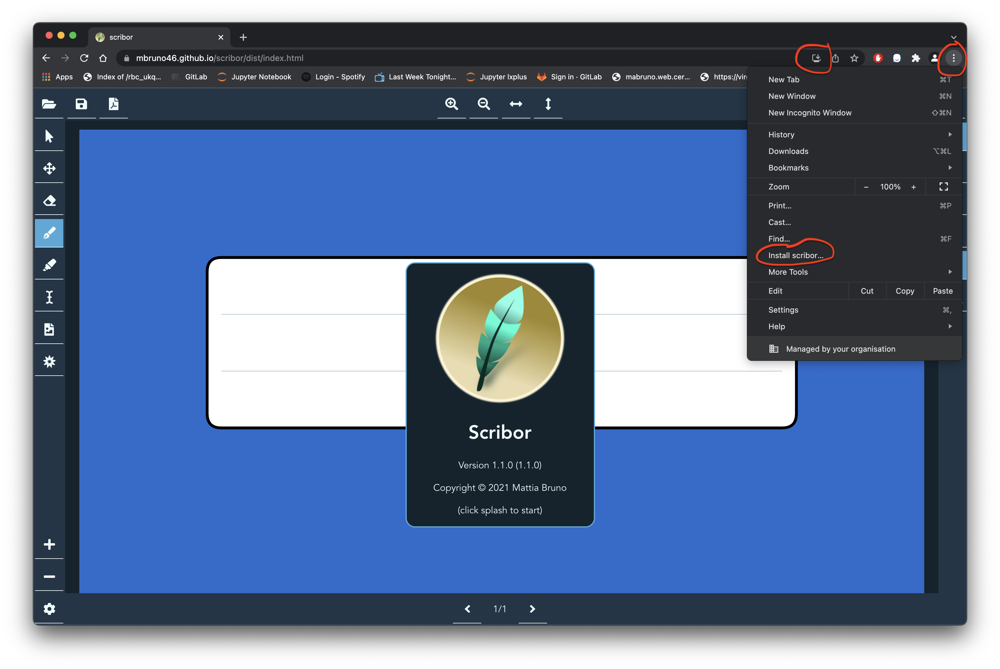

***

## Installation

The application is written as a Progressive Web App (PWA) and therefore is 
OS independent. You can try it [here](./dist/index.html)

**Local installation: Chrome**

Open the link 
[https://mbruno46.github.io/scribor/dist/index.html](https://mbruno46.github.io/scribor/dist/index.html) 
in the Chrome browser, go the top right of the window with the mouse and click on the 
`three vertical dots` button; then click `Install Scribor ...` as indicated in the figure below.

