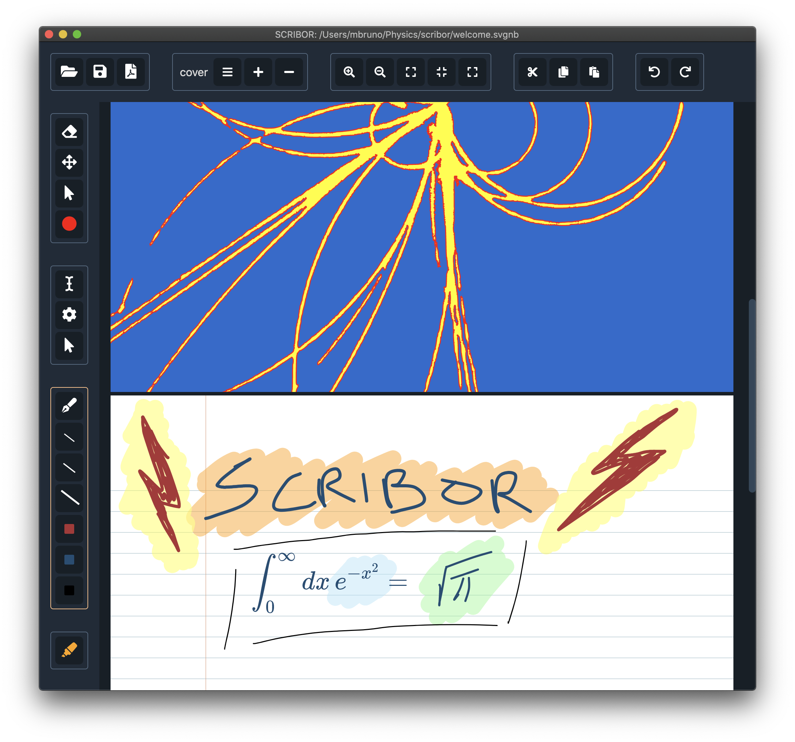

***

## Installation

Download the latest version of Scribor for your operating system
(Mac, Linux, Windows) [here](https://github.com/mbruno46/scribor/releases/latest).

 - **MacOS**

For MacOS systems download the `.dmg` file, open it and drag the scribor icon in the `/Application` folder.

Alternatively, the program can also be installed in the home Application folder, `~/Application`,
or in other destinations, by dragging the scribor icon (after opening the `dmg` file)
and dropping it in the destination folder.

If the error message `Scribor cannot be opened because the developer cannot be verified.`
appears when launching the application, click `Cancel`;
then go to `System Preferences` -> `Security & Privacy` -> `General` and click on `Open Anyway`.
